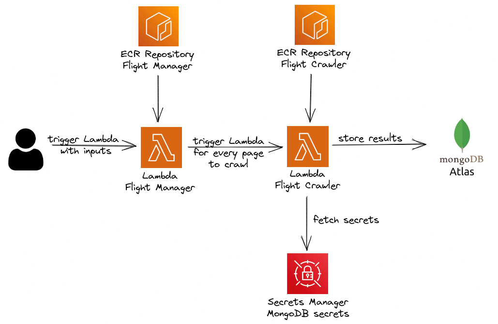

# flights

## Motivation
This project aims to solve the typical problem of the person that does have the flexibility to travel and wants to pay for a cheap flight ticket.

Let's give an example: you want to enjoy the summer season in Europe (you can search for regions and specific airports/countries) and want to travel for 10 to 14 days (this flexibility allows you to find cheaper flights).

So you have the following inputs:
- **Origin**: The city/airport that you are leaving (let's say Boston)
- **Destination**: Where you want to travel to, can be a generic region (Asia, Latin America, Asia, a country/city with more than one airport in it) or specific (city/country with a single airport). In our case this is `Europe`
- **Max initial**: 21/06/2023 (beginning of summer)
- **Max final date**: 23/09/2023 (end of summer)
- **Minimum stay**: 10
- **Maximum stay**: 14

If you had to do it manually you would have to search for every travel range possibility, i.e. vary the duration and start date of your travel.

Indeed some websites offer us the possibility to search for "flexible dates" but they are not that great, especially because:
- They pre-define the number of dates that you can analyse (a weekend, a week or 2 weeks)
- They offer the possibility to compare only 3 days after/before the selected flight search

This project solves this problem by running several web crawlers covering all the possible travel dates.


## Architecture



The architecture of this project is serverless, where we have two AWS Lambda functions:
- **Flight Manager**: Responsible for calculating all the travel possibilities and triggering the Flight Crawler Lambda for every page that needs to be crawled
- **Flight Crawler**: Uses Python and Selenium to craw the price, destination, and duration of the flights and store this info in the database

Why run this in the cloud?
You can run locally but it will be slow depending on how many crawlers need to run so I rather put this in the cloud.


## Infrastructure as Code
You can deploy the infrastructure by running the terraform code!

## Triggering the Lambda
The Flight Manager Lambda expects a JSON as a input event with the following keys:

|           **KEY**           |                                                    **Description**                                                   | **TYPE** | **OPTIONAL** | **EXAMPLE** |
|:---------------------------:|:--------------------------------------------------------------------------------------------------------------------:|:--------:|--------------|-------------|
| minDepartureDateOrigin      | Departure data from the origin. Input must be in the following format: dd/mm/yyyy                                    | string   | NO           | 10/01/2023  |
| maxDepartureDateDestination | Departure data from the destination. Input must be in the following format: dd/mm/yyyy                               | string   | NO           | 21/04/2023  |
| origin                      | Name of the origin (city or airport)                                                                                 | string   | NO           | Boston      |
| destination                 | Name of the destination (area)                                                                                       | string   | NO           | Asia        |
| minStayDays                 | Minimun number of days of the travel                                                                                 | integer  | NO           | 7           |
| maxStayDays                 | Maximum number of days of the travel                                                                                 | integer  | NO           | 14          |
| isGenericDestination        | If it's a generic destination (a region or a country/city with more than one airport in it this must be set to true. | boolean  | NO           | true        |
| currency                    | Three letters that define the used currency to fetch the prices of the flights                                       | string   | YES          | USD         |


So one possible input would be:
```json
{
    "minDepartureDateOrigin": "15/05/2023",
    "maxDepartureDateDestination": "10/06/2023",
    "origin": "CDG",
    "destination": "LIS",
    "minStayDays": 5,
    "maxStayDays": 10,
    "isGenericDestination": false,
    "currency": "EUR",
}
```

## Crawler sources
At the moment the only source is Google Flight!